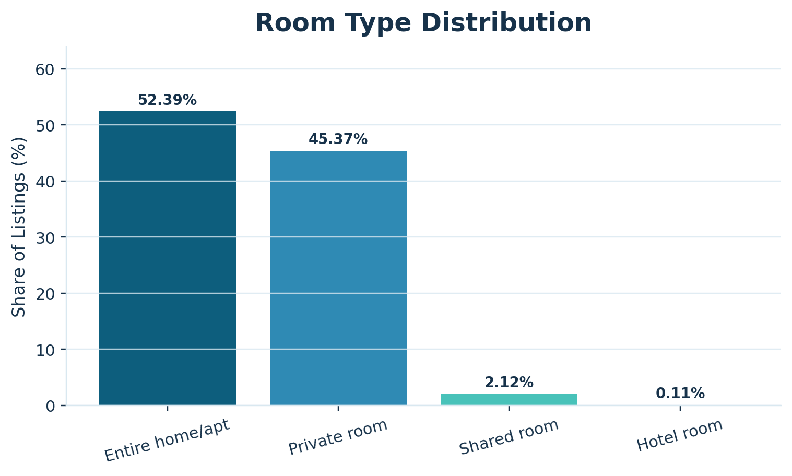
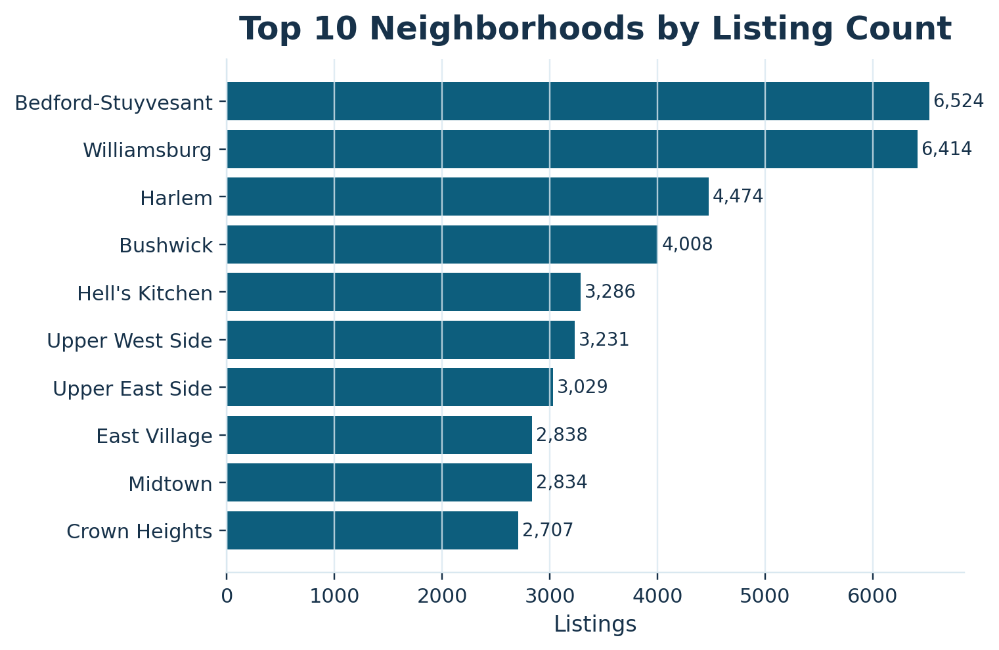
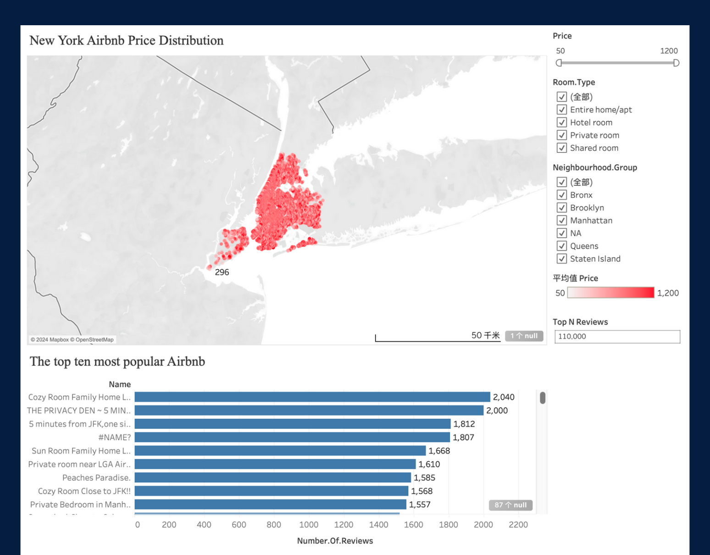
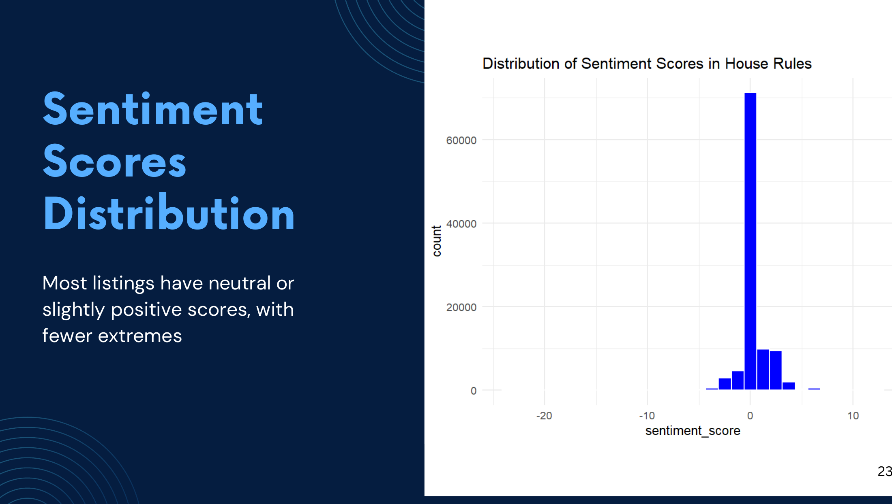
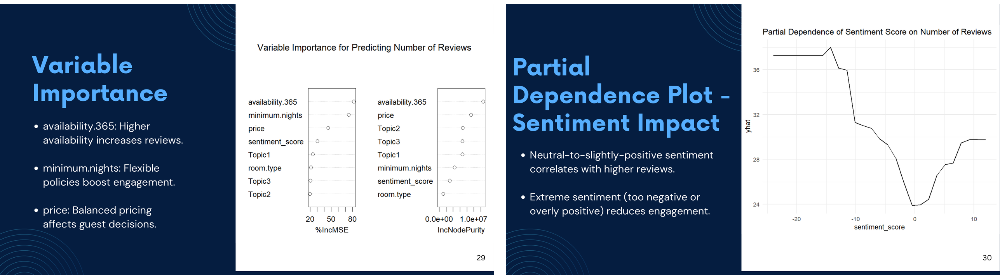
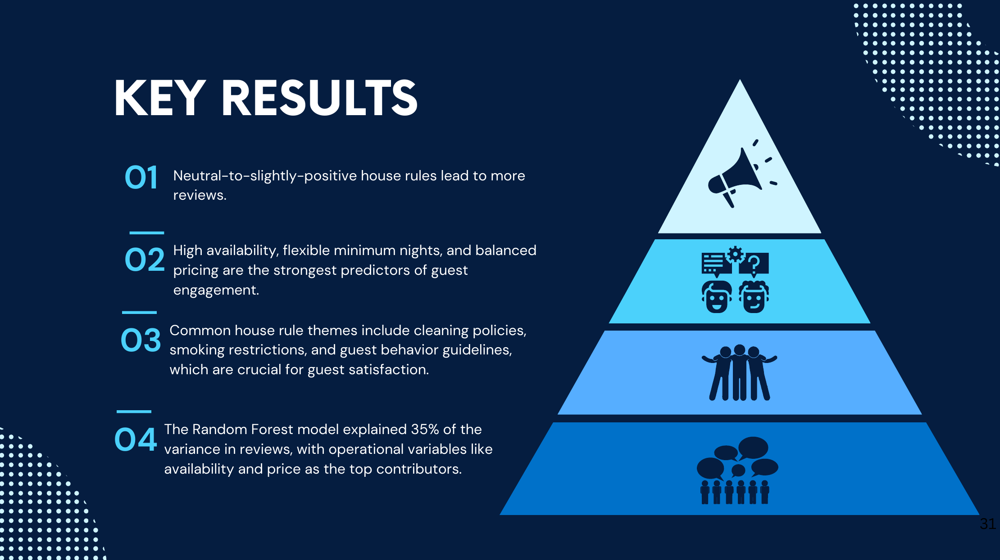

# Project Walkthrough

## 1. Project Overview

This project was my final team project for **ALY6110: Big Data and Data Management** at Northeastern University in Fall 2024.

My teammate and I used a public Airbnb dataset from New York City to study what may affect listing engagement. In this project, we treated **number of reviews** as a simple proxy for listing success.

This GitHub version is a cleaned public version for portfolio use. It keeps the main story simple and readable, while still keeping the final report, slides, original scripts, selected outputs, and a portfolio PDF version.

## 2. Business Problem

Airbnb hosts and investors want to understand why some listings get more engagement than others.

We wanted to look at:
- room type
- price
- availability
- minimum nights
- location
- house rules text

The main question was:

**Which factors seem most related to higher review volume, and can text from house rules add useful information?**

## 3. Team Note

This was a **2-person team project**.

I mainly worked on the later-stage analytics part:
- house rules text analysis
- sentiment scoring
- topic modeling
- random forest modeling
- model interpretation

I also did some cleaning and clustering in my own R script.

My teammate handled much of the earlier-stage data preparation, descriptive analysis, and some report and slide sections.

For a clearer note, see [../contribution-note.md](../contribution-note.md).

## 4. Dataset

### Main dataset
- **Airbnb Open Data**
- Source: Kaggle
- Raw file checked in this chat: **102,599 rows, 26 columns**

### Local file path used in this repo
- [../data/README.md](../data/README.md)

The full raw dataset is not included in this public repo. The scripts expect:

`data/Airbnb_Open_Data.csv`

### Main field groups used
- listing id
- host information
- neighborhood and location
- room type
- price and service fee
- minimum nights
- number of reviews
- reviews per month
- availability
- house rules text

## 5. Workflow

## 5.1 Data Cleaning

The project started with raw CSV cleaning work:
- checked duplicate rows
- removed or corrected missing values
- cleaned `$` symbols from price fields
- standardized some category values
- removed the mostly empty `license` field
- converted date fields
- created a cleaner working dataset

Related script:
- [../scripts/01_airbnb_data_cleaning_eda_wenzhuo.R](../scripts/01_airbnb_data_cleaning_eda_wenzhuo.R)

### Selected code example

~~~r
df <- read.csv("data/Airbnb_Open_Data.csv")

df$price <- gsub("[$,]", "", df$price)
df$price <- as.numeric(df$price)

df <- df[!duplicated(df), ]
df <- df[!is.na(df$price), ]
~~~

This part mattered because the raw file had duplicate rows, string-formatted price values, and missing values that had to be handled before analysis.

## 5.2 Basic Analysis and Visual Review

After cleaning, the project moved to descriptive analysis.

We looked at:
- room type distribution
- price patterns by room type and borough
- top neighborhoods by listing count
- review-related patterns
- geographic concentration of listings

### Selected figure: Room type distribution

### Selected figure: Top neighborhoods by listing count

## 5.3 Dashboard and Visual Communication

The project also included dashboard-style output to make the results easier to read.

The uploaded materials showed:
- a map-based view of listing distribution
- filters such as neighborhood group, room type, and price
- a bar chart of top reviewed listings

The original dashboard source file was not uploaded in this chat, so this repo keeps screenshots instead of the live workbook.

### Selected figure: Dashboard view

## 5.4 House Rules Text Analysis

This was the part I mainly focused on.

We wanted to see whether the tone and themes in `house_rules` could add useful information beyond the normal structured fields.

I used:
- tokenization
- stop word removal
- Bing sentiment scoring
- LDA topic modeling

### Selected code example

~~~r
tidy_rules <- airbnb_data %>%
  select(id, house_rules) %>%
  unnest_tokens(word, house_rules) %>%
  anti_join(stop_words, by = "word")

bing <- get_sentiments("bing")

rules_sentiment <- tidy_rules %>%
  inner_join(bing, by = "word") %>%
  group_by(id) %>%
  summarize(sentiment_score = sum(ifelse(sentiment == "positive", 1, -1)))
~~~

This step turned unstructured text into features that could be used later in modeling.

### Selected figure: Sentiment score distribution

### Topic themes found
From the uploaded slides, the topic modeling section summarized three broad themes:
- cleanliness and house maintenance
- guest instructions and safety
- general stay-related rules

Related script:
- [../scripts/02_airbnb_text_modeling_random_forest_cheng.R](../scripts/02_airbnb_text_modeling_random_forest_cheng.R)

## 5.5 Predictive Modeling

After creating text-based features, I used them together with structured listing variables to predict **number of reviews**.

The model used:
- sentiment score
- topic probabilities
- price
- availability
- minimum nights
- room type

The main model in the project was a **random forest**.

### Selected code example

~~~r
rf_model <- randomForest(
  number.of.reviews ~ sentiment_score + Topic1 + Topic2 + Topic3 +
    price + availability.365 + minimum.nights + room.type,
  data = train_data,
  ntree = 100,
  mtry = 3,
  importance = TRUE
)
~~~

### Selected figure: model interpretation

## 6. Results

From the uploaded report and slides, the most stable results were:

- **MAE = 19.18**
- **RMSE = 35.36**
- **R² = 0.349**

The model explained about one-third of the variation in review counts. That is not extremely high, but it still showed useful ranking of factors.

### Main factors
The strongest predictors were:
- `availability.365`
- `minimum.nights`
- `price`

The text features helped a little, but not as much as the main operational variables.

### Selected figure: key results

## 7. What I Learned

This project was useful for me because it was not only about charts.

It made me connect:
- raw data cleaning
- exploratory analysis
- text mining
- feature engineering
- machine learning
- business interpretation

It also gave me a good example of how to explain a team project honestly while still showing the part I really worked on.

## 8. Project Files in This Repo

- [Portfolio folder note](../portfolio/README.md)
- [Portfolio PDF](../portfolio/ALY6110_Module6_Airbnb_Portfolio.pdf)
- [Final report](../reports/ALY6110_Module6_Final_Report.pdf)
- [Final slides](../slides/ALY6110_Module6_Final_Presentation.pdf)
- [Cleaning and EDA script](../scripts/01_airbnb_data_cleaning_eda_wenzhuo.R)
- [Text modeling and random forest script](../scripts/02_airbnb_text_modeling_random_forest_cheng.R)
- [Data note](../data/README.md)
- [Outputs and figure note](../outputs/README.md)

## 9. Final Note

This is a portfolio-friendly public version of the project.

I kept the original report, slides, and script structure so the work still feels real and traceable, but I rewrote the repository content in a simpler and cleaner way for GitHub visitors.